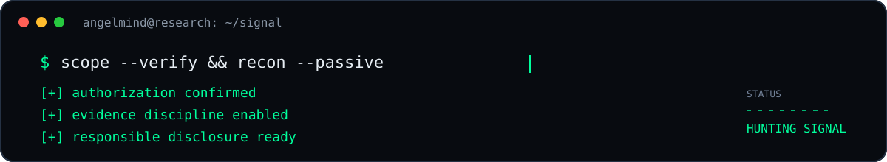
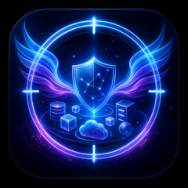
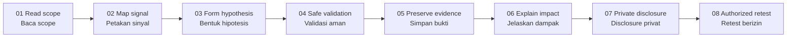

<div align="center">


# `ANGELMIND`

### `AUTHORIZED SECURITY RESEARCH // BUG BOUNTY // RESPONSIBLE DISCLOSURE`

<p>
  <strong>Find the signal. Prove the boundary. Protect the target.</strong><br />
  <sub>Temukan sinyalnya. Buktikan batasnya. Lindungi targetnya.</sub>
</p>

<a href="https://github.com/AngelMind7/AngelMind/actions/workflows/ci.yml"></a>
<a href="https://github.com/AngelMind7/AngelMind/actions/workflows/container.yml"></a>


</div>

<div align="center">



</div>

```text
┌─[ angelmind@research ]─[ ~/signal ]
└──╼ $ scope --verify && recon --passive && evidence --preserve

[+] authorization confirmed      [OK]
[+] scope boundary locked        [OK]
[+] signal mapped                [OK]
[+] evidence normalized          [OK]
[+] impact explained             [OK]
[+] responsible disclosure       [READY]
```

> **AngelMind is not a black-hat tool.** It uses a red-team-inspired visual language with white-hat discipline: explicit authorization, minimal impact, reproducible evidence, and private disclosure.
>
> **AngelMind bukan alat black-hat.** Estetikanya terinspirasi operasi red team, tetapi guardrail-nya berorientasi defensive security: izin eksplisit, dampak minimal, bukti reproducible, dan disclosure privat.

## `whoami // siapa saya`

AngelMind adalah workspace untuk **authorized security research**, **bug bounty**, **vulnerability triage**, dan **responsible disclosure**. Fokusnya adalah mengubah observasi teknis menjadi sinyal yang dapat diverifikasi: apa yang terjadi, mengapa hal itu penting, dan bagaimana pemilik sistem dapat memperbaikinya.

AngelMind bukan tempat untuk unauthorized access, credential abuse, destructive testing, denial-of-service, persistence, evasion, harassment, data exfiltration, atau pengujian di luar scope program.

<div align="center">

| `DISCOVER` | `VALIDATE` | `EXPLAIN` | `DISCLOSE` |
|:---:|:---:|:---:|:---:|
| Map the signal | Minimize the action | Prove the impact | Help fix the risk |
| Petakan sinyal | Validasi dengan aman | Buktikan dampak | Bantu perbaiki risiko |

</div>

## `capabilities // kemampuan`

<div align="center">

<a href="#scope-first"></a>
<a href="#evidence-over-noise"></a>
<a href="#responsible-disclosure"></a>
<a href="#research-loop"></a>

</div>

| Surface | What it means | Fokus |
|---|---|---|
| `scope-first` | Scope and rules of engagement stay upstream of every action. | Allowlist, exclusions, safe harbor, policy gates. |
| `signal-mapping` | Observe systems without turning curiosity into collateral damage. | Passive inventory, attack-surface mapping, hypothesis formation. |
| `evidence-over-noise` | A finding needs context, reproduction, and impact—not spectacle. | Evidence chain, confidence, severity reasoning, remediation. |
| `human-in-the-loop` | High-risk decisions require explicit review; automation never becomes permission. | Approval gates, auditability, role separation. |
| `responsible-disclosure` | The output is a useful fix, communicated through the official channel. | Triage, private reporting, retest, closure. |

## `research-loop // siklus riset`



## `tooling // alat kerja`

<div align="center">


</div>

> Tool names are references for authorized work only. Availability of a tool never overrides program scope, safe harbor, rate limits, or human approval.
>
> Nama alat hanya referensi untuk pekerjaan berizin. Ketersediaan alat tidak pernah mengalahkan scope program, safe harbor, rate limit, atau approval manusia.

## `rules_of_engagement // aturan main`

```yaml
authorization: required
scope: explicit
mode: passive-first
impact: minimize
data_access: minimum-necessary
evidence: reproducible
secrets: never publish
disclosure: responsible
availability: protect
intent: improve-security
```

Setiap eksperimen harus memiliki alasan yang jelas, batas yang terukur, dan jalur penghentian. Jika scope tidak jelas, langkah yang benar adalah **berhenti dan meminta klarifikasi**—bukan menebak.

## `evidence-over-noise // bukti di atas sensasi`

AngelMind menilai kualitas riset dari **ketepatan**, bukan volume request. Bukti harus cukup untuk reproduksi dan mitigasi, tetapi tidak boleh mengandung credential, token, data pribadi, rahasia program, atau data target yang tidak perlu.

```text
[signal]    observation with context
[proof]     smallest safe reproduction
[impact]    realistic security consequence
[fix]       actionable remediation guidance
[retest]    authorized confirmation after remediation
```

## `responsible-disclosure // pelaporan aman`

Jika menemukan masalah keamanan pada project atau target program, jangan publikasikan credential, token, data pribadi, atau detail exploit pada issue publik. Gunakan kanal security contact resmi, berikan bukti minimum yang diperlukan, dan hormati proses triage serta disclosure policy pemilik sistem.

Untuk detail keamanan repository, lihat [`docs/threat-model-register.md`](docs/threat-model-register.md), [`docs/incident-response.md`](docs/incident-response.md), dan [`docs/production-runbook.md`](docs/production-runbook.md). Dokumen publik tersebut sengaja tidak memuat credential, konfigurasi deployment, struktur internal sensitif, atau identitas operator.

## `status // kondisi`

<div align="center">


### `STATUS: SIGNAL_DISCIPLINE_ACTIVE`

<sub>Red-team aesthetic. Defensive controls. Responsible impact.</sub>

<br />

<strong>Find deeper. Prove clearly. Report responsibly.</strong>

</div>

## `references`

- [OWASP Web Security Testing Guide](https://owasp.org/www-project-web-security-testing-guide/)
- [OWASP Bug Bounty Program Guidelines](https://owasp.org/www-community/Bug_Bounty_Cheat_Sheet)
- [GitHub Security Advisories](https://docs.github.com/en/code-security/security-advisories/working-with-repository-security-advisories/about-repository-security-advisories)

<!-- Public README intentionally omits private implementation details, credentials,
internal architecture, deployment configuration, and operational procedures. -->
