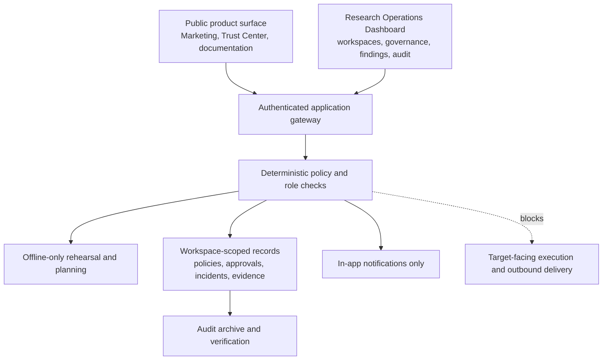

# AngelMind Master Blueprint Alignment

**Status:** Architecture and delivery specification.  
**Purpose:** Translate the supplied AI Bug Bounty master blueprint into the AngelMind product without weakening its existing deterministic safety boundaries.  
**Non-negotiable boundary:** AngelMind remains a governed research-operations control plane. It does not implement target-facing scanning, exploitation, active probing, outbound webhook delivery, credential replay, or autonomous submission.

## 1. Vision and Product Philosophy

AngelMind is designed as a transparent, cross-device workspace for authorized security-research programs. The product is valuable when it improves scope governance, evidence quality, human decisions, operational planning, and auditability. Its AI-facing layer is therefore limited to policy-aware planning, explanation, controlled classification, and rehearsal; it is not an autonomous attack execution layer.

| Principle | Product interpretation | Enforced boundary |
| --- | --- | --- |
| Safety first | Deterministic checks precede every governed state transition. | A model cannot override scope, conduct, budget, cooldown, or human approval rules. |
| Transparency | Decisions, policies, evidence references, approvals, and notification handling are retained in audit records. | User-entered evidence and audit values are not translated, rewritten, or fabricated. |
| Accessibility | Responsive, keyboard-aware, multilingual UI with persisted locale and timezone preferences. | Accessibility never exposes protected data to unauthenticated marketing routes. |
| Resilience | Typed contracts, loading states, bounded background work, explicit fallback behavior, and recoverable checkpoints. | Failure cannot silently permit a blocked operation. |
| Zero trust | Workspace-role isolation and distinct-reviewer decisions protect sensitive governance workflows. | Administrators retain no bypass for deterministic guardrails. |

## 2. High-Level System Architecture

The current production shape is intentionally smaller than the source blueprint. It uses a React and TypeScript client, an authenticated Express/tRPC application service, MySQL/Drizzle data storage, managed object storage for artifacts, and a Python reference safety package. This is sufficient for governed workspaces and should remain the default deployment profile until a proven operational requirement exists.



| Layer | Present capability | Planned evolution | Not in scope without a separate, authorized design review |
| --- | --- | --- | --- |
| Public surface | Authenticated control plane is live. | Marketing, documentation, legal, and Trust Center routes. | Claims of certifications, penetration-test results, reviews, metrics, or customer logos without verified source material. |
| Application surface | Workspaces, policy versions, findings, audit, notifications, operations, and assurance workflows. | Command palette, accessibility uplift, PWA shell, richer analytical views, and collaboration controls. | Direct target tools, request replay, scanner wrappers, or live terminal activity. |
| Research core | Python contracts for deterministic safety and offline rehearsal. | Policy-aware task schemas, sandboxed simulations, coverage accounting, and evaluation fixtures. | Active discovery, probing, fuzzing, exploitation, credential testing, and autonomous reporting. |
| Data and eventing | MySQL, managed storage, in-app notification records, signed archives. | Explicit data classifications, retention workflows, and event-schema versioning. | Unreviewed third-party delivery or persistent retention of sensitive payloads. |
| Hosting | Managed authenticated web application. | Managed background metadata-only checks within policy and runtime limits. | Kubernetes, Docker, queues, or dedicated infrastructure absent a demonstrated workload requirement. |

## 3. Repository Structure: Target State

The repository will evolve incrementally rather than create unused microservices. Existing TypeScript application code and Python safety reference code remain the source of truth until a component has a tested, independently deployable reason to separate.

```text
AngelMind/
├── client/                         # React application: public and authenticated route shells
│   └── src/
│       ├── marketing/               # Public product, trust, legal, and documentation presentation
│       ├── pages/                   # Authenticated dashboard surfaces
│       ├── components/              # Shared, accessible design-system components
│       ├── contexts/                # Locale, theme, and client preferences
│       └── locales/                 # Typed UI resources; English fallback
├── server/                          # tRPC procedures, policy-bound service workflows
│   └── control-plane/               # Roles, guardrails, rehearsal, audit, assurance contracts
├── research-service/                # Python reference contracts and deterministic tests only
│   └── src/angelmind_research/
├── drizzle/                         # MySQL schema and forward-only migrations
├── docs/                            # Architecture, safety, i18n, operations, rollout evidence
├── scripts/                         # Repeatable maintenance and locale-resource generation
├── .github/                         # CI, dependency review, code ownership, issue templates
└── infrastructure/                  # Deferred, reviewed deployment descriptors—not a default runtime dependency
```

The proposed `ai-core`, `api`, `web`, and `infrastructure` domains from the source blueprint are retained as architectural boundaries, not prematurely created services. An API gateway or Python service split is only justified when contract ownership, latency, security isolation, or runtime needs make the integrated service insufficient. Any future service contract must be versioned, authenticated, workspace-scoped, and guarded before feature logic executes.

## 4. Two-Layer Website and Page Ownership

The public surface and the authenticated application must have distinct route shells, data contracts, and threat models. Marketing pages cannot access workspace data; the dashboard cannot present unverified public claims as operational truth.

| Layer | Route family | Page purpose | Data rule |
| --- | --- | --- | --- |
| Marketing | `/`, `/features`, `/trust`, `/docs`, `/pricing`, `/contact`, `/security` | Explain the product, safe operating model, documentation, policy posture, and contact path. | Static, reviewed editorial content only. No testimonials, fabricated metrics, or client records. |
| Authenticated application | `/app`, `/workspaces`, `/organizations`, `/research`, `/researcher`, `/ai-center`, `/profile`, `/security`, `/governance`, `/findings`, `/audit`, `/operations`, `/notifications`, `/operations-console`, `/assurance` | Govern tenant, program, research, AI, identity, and workspace-scoped records. | Protected by Firebase bearer token or scoped API key, role policy, audit events, and row-level workspace logic. |

### Marketing-page breakdown

The launchable marketing baseline consists of a purpose-led home page, feature overview, documentation index, Trust Center, security disclosure route, legal pages, and contact path. The Trust Center may describe implemented controls, supported operating boundaries, data-handling principles, and responsible disclosure instructions; it must not claim certifications, audits, or service guarantees until those claims are independently verified.

The first public implementation is available as a route-isolated marketing shell at `/product`, with related `/features`, `/trust`, `/docs`, and `/security` pages. It ships only reviewed, safety-bounded copy and does not receive authenticated workspace data. The existing `/` command-center route is preserved during the staged public-root migration to avoid breaking established dashboard deep links.

The interactive demonstration should show a **closed offline rehearsal** using synthetic, non-target data only. It must label each state as simulated and never imply that a user-supplied domain has been contacted. The first API Playground foundation is now live at `/api-playground`: it is route-isolated, uses read-only synthetic request/response examples, localizes its UI, renders identifiers and payloads left-to-right in RTL layouts, and contains no credential input, request dispatch, or mutable operation. Pricing, academy, blog, and public roadmap remain later editorial/product workstreams requiring verified content, ownership, and legal review before publication.

### Authenticated-dashboard breakdown

The current dashboard already owns the safe core: command center, workspace vault, governance gate, findings ledger, evidence and audit, observability, operations console, Signal Center, and Assurance Control. Future Mission Control, coverage, memory, and analytics screens should present policy status, offline planning outputs, evidence references, approvals, and aggregate workflow data—not remote target telemetry or executable attack controls.

## 5. Global Localization: 20 Languages and RTL

AngelMind currently supports 12 interface locales: English, Indonesian, Malay, Arabic, Simplified Chinese, Japanese, Korean, Spanish, Portuguese, French, German, and Russian. The next eight-language expansion is Hindi, Vietnamese, Thai, Turkish, Polish, Dutch, Italian, and Swedish; this preserves the existing user-approved Malay support while meeting the 20-locale target.

| Priority | Locales | Delivery requirement |
| --- | --- | --- |
| Existing release | `en`, `id`, `ms`, `ar`, `zh-CN`, `ja`, `ko`, `es`, `pt`, `fr`, `de`, `ru` | Typed interface copy, English fallback, persisted locale, locale-aware dates/numbers, and Arabic RTL. |
| Expansion | `hi`, `vi`, `th`, `tr`, `pl`, `nl`, `it`, `sv` | Locale resource completeness tests, CJK/complex-script visual QA where applicable, and informed consent before any machine-assisted translation of editorial material. |
| RTL | `ar` now; future Hebrew/Persian only if approved | Logical CSS, right sidebar, reversed directional controls, LTR isolation for hashes, URLs, and identifiers. |

UI text, controlled error messages, notification templates, and static report templates are localizable. Workspace names, policy text, incident narratives, evidence, hashes, external URLs, IDs, audit records, and credentials must remain their original values. Translation fallback must be visible in tests and must never change governance meaning.

## 6. Responsive, Cross-Device, and PWA Requirements

The existing dashboard already prioritizes a collapsible desktop sidebar, compact mobile header, responsive grids, and touch-safe controls. The next responsive milestone adds 44px minimum touch targets, route-specific table-to-card patterns, safe-area CSS, keyboard shortcuts on desktop, and mobile bottom navigation only after route ownership is simplified.

PWA support is now implemented as a reviewed web manifest, a managed icon, static-asset precaching, and an explicit offline status screen. API, audit, evidence, governance, and internal diagnostic paths are excluded from navigation fallback and remain network-bound; they are not cached as if they were authoritative state. Offline mode cannot enable decisions or mutate records. User-controlled notification permission and platform-specific install guidance remain follow-on work.

## 7. Design System

The visual system remains cyberpunk, high-contrast, and operational rather than decorative. Semantic tokens—not page-specific color literals—must express policy, status, risk, and focus state.

| System layer | Required components | Quality standard |
| --- | --- | --- |
| Foundations | Semantic colors, typography scale, 4px spacing scale, radius/elevation, motion tokens, high-contrast mode. | WCAG-aware contrast, readable density, and reduced-motion handling. |
| Layout | App shell, sidebar, top bar, mobile navigation, page header, responsive grid, split pane, sheet, dialog, tooltip. | Keyboard navigable, RTL compatible, and touch safe. |
| Data | Cards, tables, timeline, badge, progress, chart wrapper, empty/error/skeleton states. | Data provenance, no synthetic user activity, and visible loading/error states. |
| Inputs | Buttons, fields, selects, toggles, file reference control, filters, confirm dialogs. | Validation feedback, clear destructive-action hierarchy, and no raw implementation errors. |
| Domain | Policy gate, approval card, evidence reference, finding card, budget meter, activity feed, locale/timezone controls. | Never changes policy or audit data merely to improve presentation. |

## 8. Premium Experience: Safe Adoption Order

Motion, sound, gamification, onboarding, exports, Trust Center, and API exploration can make the product feel deliberate when they serve clarity. They must be optional, restrained, and never disguise risk, evidence status, or approval state.

| Feature | Safe product expression | Guardrail |
| --- | --- | --- |
| Motion | Short transform/opacity transitions, status pulse, progressive skeletons, and reduced-motion preference. | No misleading "live attack" animations. |
| Sound and haptics | Explicitly opt-in confirmation and alert cues. | No autoplay; emergency/blocked states remain visually explicit without sound. |
| Gamification | Private progress for documentation, safe workflows, or locale setup. | No fabricated findings, rankings, or incentives to bypass policy. |
| Cinematic onboarding | Explain workspace isolation, safe harbor, tiers, rehearsal, evidence, and reviewer roles using sample policy states. | All samples are clearly marked simulation; no mock customer review or discovery claim. |
| Trust Center | Implemented controls, data-handling scope, contact path, and reviewed policies. | No unverified compliance badges or audit outcomes. |
| API Playground | Read-only documentation explorer with synthetic examples. | No live credentials, target endpoints, or mutating operational calls. |
| Exports | Reviewable PDF/CSV summaries with evidence references and watermark option. | Human review before external submission; no automatic disclosure. |

## 9. Security and Safety

Every design and implementation phase must preserve the existing deterministic flow: scope and safe-harbor validation, conduct policy, workspace role, budget/session/cooldown, governance tier, then allowed state transition. Any failed check returns a clear block result and audit record. Tier 3 remains human-only with a distinct decision-maker requirement.

> The source blueprint describes Tier 1 and Tier 2 execution. AngelMind adapts those as **offline planning and rehearsal classifications only**. No tier authorizes direct target interaction in the deployed product.

Legal and privacy work includes reviewed safe-harbor records, program-specific conduct controls, evidence-chain hashing, retention review rather than automatic destructive deletion, role-scoped credential references, disclosure policy, and incident handling. Authentication, secure sessions, rate limits, CSP, CSRF protections, account-security improvements, and auditability are planned as a separate security baseline; they must be verified against the actual runtime before public claims are made.

## 10. Lifecycle and Research Workflow

The finding lifecycle remains `discovered → triaged → candidate → reproducing → validated → reported`, with `invalid`, `duplicate`, and `inconclusive` outcomes. The final external submission step is deliberately outside the current product and remains subject to human review and authorized workflow integration.

The safe research loop is: load workspace context, verify safe harbor, verify scope, classify governance tier, create offline hypothesis and coverage plan, run zero-network rehearsal, retain policy and evidence references, collect human decision where required, update non-sensitive planning records, and pause for review or a metadata-only scheduled check. This loop is valuable without target probing and avoids the dangerous assumption that an AI may autonomously progress from hypothesis to external action.

## 11. Infrastructure and Deployment Phases

| Phase | Outcome | Required gate |
| --- | --- | --- |
| 0 — Foundations | Repository conventions, schema discipline, typed contracts, CI, deployment baseline, security headers plan. | Architecture review and deterministic safety test baseline. |
| 1 — Governed core | Workspace roles, policy, approval, audit, evidence, rehearsal, notifications. | Blocked-operation, workspace-isolation, and no-network invariants. |
| 2 — Product shell | Marketing/public separation, Trust Center, responsive design system, PWA shell, 20-locale resources. | Content/legal review, accessibility review, and no sensitive public data. |
| 3 — Operations depth | Coverage, read-only analytics, collaboration, export, API documentation explorer. | Data provenance, role restrictions, and human-review gates. |
| 4 — Platform hardening | Monitoring, backup/restore evidence, performance work, incident exercises, dependency posture. | Load/security test evidence and rollback plan. |
| 5 — Controlled launch | Invite-only access, observability review, documented support and disclosure workflows. | Launch checklist approval and verifiable public claims. |

Managed hosting remains the default. A persistent or containerized service is only justified for a real, reviewed workload that cannot fit the managed application’s scheduled/job model. External webhooks remain drafts until an endpoint, secret, signing policy, owner confirmation, and separate reviewer decision are all complete; delivery remains disabled by default.

## 12. Testing Strategy: Defect Prevention Rather Than a "Zero-Bug" Claim

No software system can credibly promise zero defects. AngelMind uses a verification strategy that makes unacceptable failures difficult to introduce and easy to detect.

| Test tier | Focus | Release condition |
| --- | --- | --- |
| Unit and property tests | Scope exclusions, policy decisions, tiers, role matrix, dry-run isolation, locale fallback, timezone formatting. | Deterministic safety properties pass for generated and fixed cases. |
| Contract and integration tests | tRPC procedures, database helpers, storage references, notification suppression, archive verification. | No procedure bypasses role or workspace checks. |
| UI and accessibility tests | Critical keyboard flows, responsive navigation, RTL placement, locale selectors, error and empty states. | No blocking visual or accessibility regression on supported breakpoints. |
| Performance tests | Route chunk sizes, loading states, render cost, controlled API latency. | Performance budget is recorded; regressions need review. |
| Security validation | Dependency posture, auth/session behavior, CSP/CSRF/rate-limit verification, misuse and abuse cases. | Findings have owner, mitigation decision, and evidence. |

## 13. Launch-Readiness Checklist: 35 Verified Items

The following is a verification register, not a promise. Each item requires evidence before being represented publicly as complete.

1. Custom skeletons; 2. no lorem ipsum; 3. safe user-facing errors; 4. visible focus/hover states; 5. reduced-motion-aware transitions; 6. 44px mobile targets; 7. list gestures only where discoverable; 8. desktop shortcuts; 9. meaningful empty states; 10. opt-in sound; 11. opt-in haptics; 12. theme preferences; 13. reviewable exports; 14. safety-first onboarding; 15. non-competitive progress badges; 16. evidence-based Trust Center; 17. read-only API explorer; 18. collaboration presence only with privacy review; 19. scoped comments and mentions; 20. disabled-by-default external integration drafts; 21. status communication; 22. reviewed roadmap; 23. dated changelog; 24. 20 locale resources plus RTL QA; 25. installable PWA shell; 26. command palette; 27. recorded performance budgets; 28. accessibility evidence; 29. custom 404/500 experiences; 30. favicon and share metadata; 31. semantic budget visualization; 32. policy-status indicator; 33. safe loading visualization; 34. coverage planning visualization; 35. recoverable, cinematic-but-clear error states.

## 14. Navigation and Information Architecture

Marketing navigation prioritizes Product, Features, Documentation, Trust, Security, Changelog, and Sign in. Its footer groups product, resources, company, and legal routes. The authenticated primary navigation remains bounded: Command Center, Workspaces, Governance, Findings, Audit, Operations, Assurance, and Notifications. Secondary controls include language, timezone, profile/session, and Help. Any future Mission, Coverage, Memory, Analytics, or Settings surfaces belong in a structured secondary area after their underlying data contracts exist.

On mobile, the current compact header remains the safe baseline. A five-tab bottom navigation should be introduced only after usability testing validates the route set and when it can preserve access to approvals, policy blocks, and notifications without hiding critical governance state.

## 15. Conclusion and Next Build Sequence

The supplied blueprint is a strong product ambition, but AngelMind must deliver it as a **governed, evidence-led research operations platform**, not an autonomous target-testing system. The immediate implementation sequence is: establish the public marketing/Trust shell; promote the 20-locale data model with visual coverage; complete responsive/PWA accessibility foundations; then add read-only product depth such as documentation, API reference explorer, and verified analytical views. At every milestone, the scope/policy/tier/budget/role safeguards remain upstream of the user experience and cannot be bypassed by a model, administrator, or visual feature.
